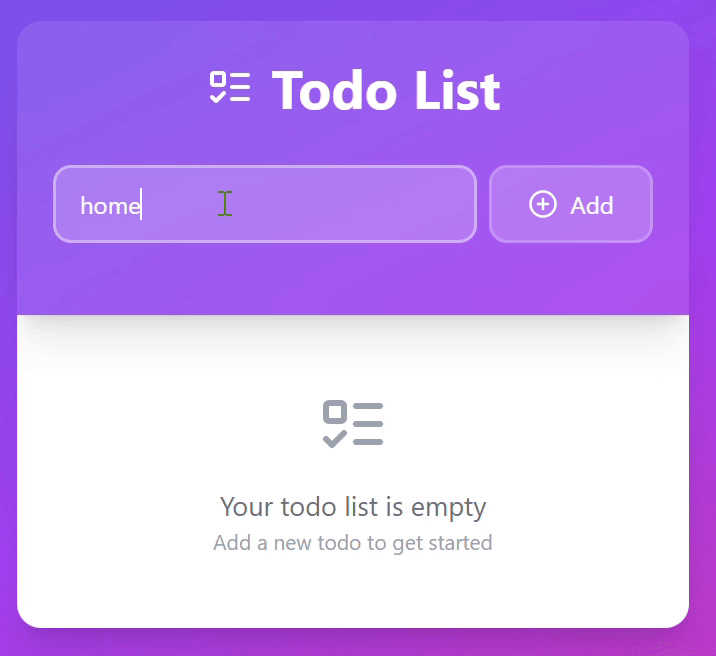

# 📝 React To-Do List

A simple To-Do List app built with React.  
This project allows you to **add** and **delete** tasks with ease.

## 📸 Demo

 <!-- Ganti path sesuai dengan lokasi GIF kamu -->

---

## ✨ Features

- ✅ Add new tasks
- ❌ Delete tasks
- 💾 Stored in React state (no backend)
- ⚡ Built with Vite for fast development

---

## 🚀 Getting Started

Ikuti langkah-langkah di bawah untuk menjalankan project ini di lokal:

### 1. Clone Repo

```bash
git clone https://github.com/danielaugust67/Simpe-To-Do-List-React.git
cd todo-react
```

### 2. Install Depedeny

```bash
npm install
```

```bash
npm run dev
``` 